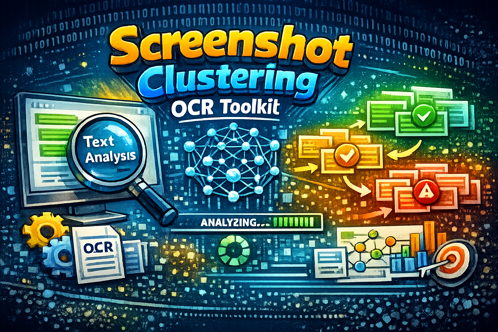

# k6 Visual Inspector

A small toolkit for post-processing `k6/browser` screenshots after load or UI test runs.



It groups visually similar screenshots, extracts OCR text, detects basic UI composition, and generates a compact report so you can quickly understand repeated UI failures instead of reviewing hundreds of nearly identical images manually.

## What it does

- Clusters screenshots by visual similarity, OCR text, and UI layout composition.
- Detects common UI patterns such as dialogs, content frames, headers, empty states, loading screens, and browser errors.
- Extracts text from full screenshots, central areas, and detected regions.
- Produces representative screenshots for each cluster.
- Generates HTML, JSON, JSONL, CSV, and cluster folders for manual triage.
- Supports parallel processing for large screenshot sets.

## Use case

This project is useful when a `k6/browser` run produces many screenshots, and most of them look similar or differ only by dynamic text such as IDs, timestamps, counters, or request-specific messages.

Instead of reviewing screenshots one by one, you get a grouped report like:

```text
cluster-000 error_modal.backend_500 count=143 severity=high
cluster-001 loading.timeout count=87 severity=high
cluster-002 empty_state.no_data count=41 severity=low
cluster-003 browser_error.bad_gateway_502 count=12 severity=high
```

## Install

```bash
python3 -m venv .venv
source .venv/bin/activate

pip install -r requirements.txt
```

Tesseract is required for OCR:

```bash
# macOS
brew install tesseract

# Debian / Ubuntu
sudo apt-get install -y tesseract-ocr tesseract-ocr-eng
```

Optional Russian OCR:

```bash
sudo apt-get install -y tesseract-ocr-rus
```

## Usage

```bash
python3 cluster_screenshots.py ./screenshots ./analysis
```

Recommended first run:

```bash
python3 cluster_screenshots.py ./screenshots ./analysis \
  --ocr-engine tesseract \
  --ocr-mode fast \
  --workers auto
```

Balanced OCR mode:

```bash
python3 cluster_screenshots.py ./screenshots ./analysis-balanced \
  --ocr-engine tesseract \
  --ocr-mode balanced \
  --workers auto
```

Debug OCR crops:

```bash
python3 cluster_screenshots.py ./screenshots ./analysis-debug \
  --ocr-mode fast \
  --debug-ocr
```

## Outputs

```text
analysis/
  report.html
  clusters.json
  items.jsonl
  cluster-summary.csv
  similarity_visual.npy
  similarity_text.npy
  similarity_layout.npy
  similarity_rule.npy
  similarity_combined.npy
  overlays/
  clusters/
  debug-ocr/
```

The main file to open is:

```text
analysis/report.html
```

## Status

Experimental but practical. The current approach is intentionally local-first and explainable: OpenCV, image hashes, OCR, rule-based labels, and clustering. LLM or embedding-based labeling can be added later as an optional layer on top of representative clusters.